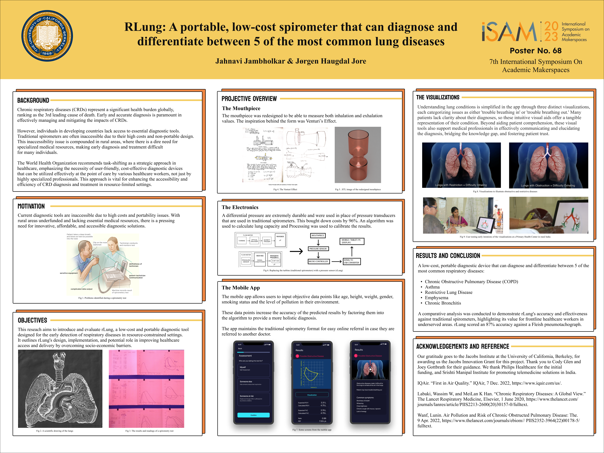

# Project Title

## 📄 View Poster PDF
[Click here to view the PDF](ISAM-2023-Student-Poster-rlung_FINAL.pdf)

## 🖼️ Poster Image

## Code:
The code is written in the IDE Processing, a creative coding language that helps with visualizations. It is necessary to download Processing for the project to function. Additionally, if viewed in VSCode, get the processing extension.

The code comprises four pde files: addtime, controller, graph, and input. They interact with each other

Further Expansion:

